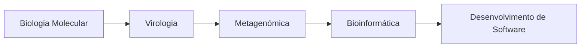

<div align="center">

# Olá, sou a Ângela Costa 👋

### 🧬 Investigação científica · 💻 Desenvolvimento de Software


<br>

[](mailto:angelacostinha@gmail.com)


</div>

---

## 👩‍🔬 Sobre mim

Sou investigadora sénior em **Biologia Molecular, Virologia e Metagenómica**, com mais de 15 anos de experiência científica.

Atualmente, estou a fazer a transição para o **desenvolvimento de software**, aplicando ao código as competências que construí na investigação:

> **Rigor metodológico, pensamento analítico, curiosidade e persistência na resolução de problemas complexos.**

* 🎓 Doutoramento em **Virologia**
* 🧬 Pós-doutoramento em **Metagenómica**
* 💻 Formação em **Software Development** no CESAE Digital
* 📱 Projetos em **Laravel, Kotlin/Android, C# e bases de dados relacionais**
* 📍 Braga, Portugal

---

## 🚀 Atualmente

```text
🔭 A desenvolver projetos web e mobile
🌱 A aprofundar Laravel, Kotlin, C#, JavaScript e SQL
🧪 A explorar a ligação entre ciência, dados e software
🎯 Objetivo: criar soluções digitais úteis, robustas e bem estruturadas
```

---

## 🛠️ Tecnologias e Ferramentas

### Desenvolvimento

<p align="left">
  
</p>

### Ciência e Dados


---

## 🧩 O que me diferencia

<table>
<tr>
<td width="50%" valign="top">

### 🔬 Mentalidade científica

* Análise crítica
* Validação de resultados
* Documentação rigorosa
* Trabalho com dados complexos
* Aprendizagem contínua

</td>
<td width="50%" valign="top">

### 💻 Mentalidade de desenvolvimento

* Resolução estruturada de problemas
* Código organizado e legível
* Desenvolvimento iterativo
* Atenção à experiência do utilizador
* Colaboração e controlo de versões

</td>
</tr>
</table>

---

## 📌 Projetos em destaque

<table>
<tr>
<td width="50%" valign="top">

### 🌐 Aplicação Web com Laravel

Aplicação com autenticação, operações CRUD, validação de dados e integração com base de dados relacional.

**Tecnologias:** Laravel · PHP · MySQL · Bootstrap

</td>
<td width="50%" valign="top">

### 📱 Aplicação Android

Aplicação mobile desenvolvida em Kotlin, com navegação entre ecrãs, gestão de dados e interface orientada ao utilizador.

**Tecnologias:** Kotlin · Android Studio · SQLite

</td>
</tr>
<tr>
<td width="50%" valign="top">

### ⚙️ Projeto em C#

Aplicação orientada a objetos, com organização modular, validação de dados e foco em boas práticas de programação.

**Tecnologias:** C# · .NET · SQL

</td>
<td width="50%" valign="top">

### 🧬 Ciência e Bioinformática

Experiência em investigação, análise de dados biológicos, metagenómica, virologia e desenvolvimento de metodologias laboratoriais.

**Áreas:** Bioinformática · Metagenómica · Biologia Molecular

</td>
</tr>
</table>

---

## 📊 Estatísticas GitHub

<div align="center">


<br>


</div>

---

## 🏆 Percurso científico

* 📄 **6 publicações científicas**, incluindo 5 em revistas Q1
* 🥇 **Patente Nacional INPI**, relacionada com extração de DNA para estudos metagenómicos
* 🎓 **Doutoramento em Virologia**
* 🧬 **Pós-doutoramento em Metagenómica**
* 🔬 Mais de **15 anos de experiência em investigação científica**

---

## 🌱 A minha transição



---

<div align="center">

### 📫 Vamos conversar?

Estou disponível para colaborar em projetos de **software, ciência de dados, bioinformática e tecnologia aplicada às ciências da vida**.


<br><br>

> *“Da bancada de laboratório ao editor de código — a curiosidade científica não muda, só a ferramenta.”*

</div>
